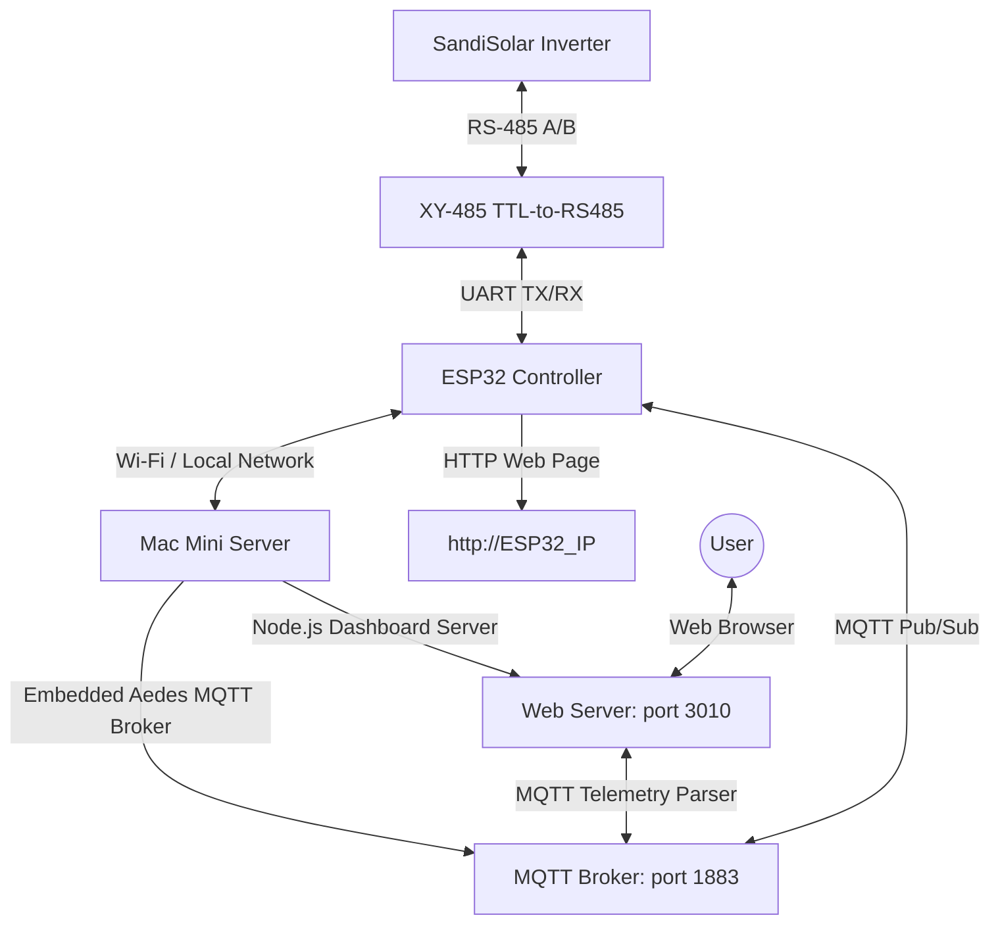

# Standalone Integration: ESP32 + SandiSolar / Aohai Inverter Telemetry & Control

This project provides a standalone integration for **SandiSolar / Aohai (6kW and similar models)** hybrid inverters. It enables reading telemetry and controlling settings directly over **RS-485 Modbus RTU** using an ESP32 microcontroller, publishing telemetry to a local MQTT broker, and rendering a real-time web dashboard without relying on Home Assistant.

---

## 📐 Project Architecture



---

## 🔌 Hardware Setup & Wiring

### 1. Components
*   **Microcontroller:** ESP32 DevKitC (WROOM-32)
*   **RS-485 Adapter:** Blue **XY-485 (TTL-to-RS485)** module (featuring automatic hardware flow control, requiring no RE/DE control pins).
*   **Cable:** Standard CAT5e/CAT6 Ethernet cable to connect the XY-485 adapter to the inverter's RJ45 Modbus port.

### 2. Wiring Pinout

#### ESP32 to XY-485 Adapter
*   **ESP32 5V (or Vin)** ➡️ **XY-485 VCC**
*   **ESP32 GND** ➡️ **XY-485 GND**
*   **ESP32 GPIO18 (TX)** ➡️ **XY-485 RXD** (Software swapped pin configuration)
*   **ESP32 GPIO19 (RX)** ➡️ **XY-485 TXD** (Software swapped pin configuration)

#### XY-485 to Inverter (RJ45 Port)
Refer to the inverter's Modbus port diagram. A standard CAT5e wire is terminated to connect the adapter pins:
*   **XY-485 A+** ➡️ **Inverter RS485-A**
*   **XY-485 B-** ➡️ **Inverter RS485-B**
*   *Note: Ensure grounds are shared if communication is unstable.*

---

## 🛠️ Software & Firmware Setup

### 1. ESP32 Firmware (ESPHome)
The firmware is built using **ESPHome** in a standalone MQTT-centric configuration.

*   **Config File:** `sandisolar.yml` (copy `secrets.yaml.example` to `secrets.yaml` and set your credentials)
*   **Direct Modbus RTU Address Mapping:**
    Uses **0-based factory addresses** from the datasheet (no shift, unlike 1-based PC testing software):
    *   `OnOffSet` (Power Switch): address `0` (Holding, bitmask 1)
    *   `Battery Max Charge Current`: address `129` (Holding, multiplier `0.01`)
    *   `AC Grid Charge Current`: address `189` (Holding, multiplier `0.1`)
    *   `Inverter Charge Source Priority`: address `181` (Holding, select mapping)
    *   `Inverter Output Source Priority`: address `182` (Holding, select mapping)
    *   `Bluetooth Status`: address `231` (Holding, read-only binary sensor)
    *   `Buzzer Status`: address `207` (Holding, read-only binary sensor)

*   **Local Automations:**
    The ESP32 runs onboard automations to protect the battery and change charging priorities based on State of Charge (SOC):
    *   **SOC < 25%:** Swaps Output priority to **Utility First (UTI)**.
    *   **SOC < 15%:** Swaps Charge priority to **Solar & Utility (SNU)** to force grid charge.
    *   **SOC > 40%:** Swaps Charge priority back to **Solar Only (OSO)**.
    *   **SOC > 50%:** Swaps Output priority back to **Solar-Utility-Battery (SBU)**.

### 2. Node.js Dashboard & MQTT Server
A lightweight Node.js server hosts the web dashboard on **port 3010** and runs an embedded MQTT broker.

*   **Server File:** `server.js`
*   **MQTT Broker Port:** `1883`
*   **Credentials:** Username `sandisolar_inv`, Password `sandisolar_pass`
*   **Topic Mapping:**
    Subscriptions listen to the `sandisolar-controller/sensor/+/state` MQTT wildcard. The server maps the incoming ESPHome sensor topics back to virtual register slots to feed the real-time telemetry matrix.

---

## 🚀 Running the Project

### Flashing Firmware to ESP32
Ensure your Python virtual environment (`venv`) is activated, and run:
```bash
# Run compilation and flash wirelessly or over serial
esphome run sandisolar.yml
# View real-time logs from the ESP32
esphome logs sandisolar.yml
```

### Launching Node.js Server
The server runs locally on the macOS host mini-PC.
```bash
# Run manually
node server.js
```
*Note: A launchd agent plist is configured at `~/Library/LaunchAgents/com.antigravity.mqtt.plist` to run this server automatically on macOS startup.*

---

## 📑 Modbus Telemetry Registry Specifications

| Register Address | Data Type | Read / Write | Parameter Description | Scaling / Unit |
| :--- | :--- | :--- | :--- | :--- |
| **0 (Holding)** | `uint16` | R/W (bitmask) | Inverter Power Switch | `0` = Off, `1` = On |
| **0 (Input)** | `uint16` | Read-only | Inverter Status (Mode) | `0` = Waiting, `1` = On-grid, `2` = Off-grid, `5` = Bypass |
| **129** | `uint16` | R/W | Max Battery Charge Current | `0.01` (A) |
| **189** | `uint16` | R/W | Max AC Grid Charge Current | `0.1` (A) |
| **181** | `uint16` | R/W | Battery Charging Priority | `0` = CSO, `1` = SNU, `2` = OSO |
| **182** | `uint16` | R/W | Load Output Priority | `0` = SOL, `1` = UTI, `2` = SBU |
| **207** | `uint8` | Read-only | Internal Buzzer Enabled | `0` = Muted, `1` = Enabled |
| **231** | `uint8` | Read-only | Onboard Bluetooth Enabled | `0` = Off, `1` = On |

*Note: System configuration flags like Bluetooth and Buzzer accept remote commands to disable (`0`), but the inverter firmware blocks remote enabling (`1`) via the Modbus interface for local security reasons (returning Modbus exception 3). They are therefore configured as read-only diagnostic binary sensors.*

---

## 🙏 Acknowledgements & Credits

Special thanks to [@bootuz-dinamon](https://github.com/bootuz-dinamon) for the foundational reverse engineering and research on the Sandisolar / Aohai inverter Modbus protocol:
* **Repository:** [Sandisolar-Aohai-AO-6KSL-G3-Home-Assistant-integration](https://github.com/bootuz-dinamon/Sandisolar-Aohai-AO-6KSL-G3-Home-Assistant-integration)
* The Modbus register mapping, protocol specifications, and integration findings provided in their work served as an essential reference for building this standalone MQTT controller and dashboard.
