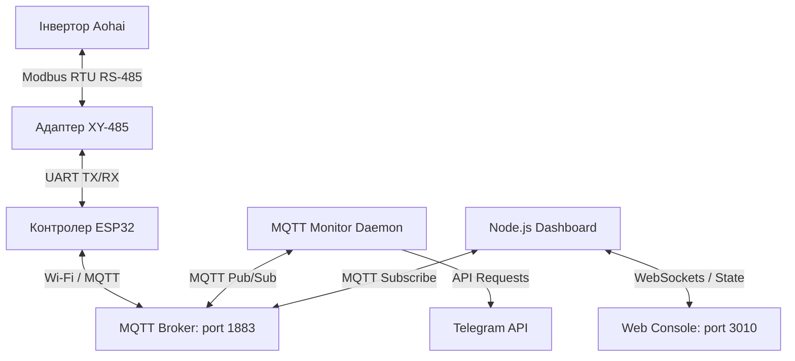

# Детальний опис проекту автоматизації керування інвертором SandiSolar Aohai

Цей документ містить повний технічний опис архітектури, взаємодії служб, апаратних пристроїв, форматів статусів та поведінкової моделі системи автоматичного керування гібридним інвертором **SandiSolar Aohai AO-6KSL-G3** через локальний MQTT-брокер на Mac Mini.

---

## 1. ⚙️ Архітектура пристроїв та інтерфейсів

Система побудована за схемою локального збору даних та керування без залучення сторонніх хмарних сервісів чи інтернету.



### Характеристики вузлів:
1.  **Гібридний інвертор SandiSolar Aohai (AO-6KSL-G3)**:
    *   Виступає як Modbus Slave (ID: 1).
    *   Надає прямий інтерфейс зчитування телеметрії (Input/Holding регістрами) та запису налаштувань.
2.  **ESP32 (ESPHome)**:
    *   Апаратний міст між Modbus RTU та Wi-Fi.
    *   Фізично підключений через плату XY-485 (автоматичний контроль напрямку передачі) до UART-інтерфейсу: **TX ➡️ GPIO18**, **RX ➡️ GPIO19**.
    *   Зчитує дані кожні 5 секунд, публікує їх у MQTT-брокер.
3.  **Mac Mini (Локальний сервер)**:
    *   Працює як хост для брокера повідомлень, веб-інтерфейсу та логічного ядра автоматизації.

---

## 2. 🗂️ Опис системних служб (LaunchAgents на Mac Mini)

Автоматизація та інфраструктура на Mac Mini підтримуються трьома фоновими службами macOS (LaunchAgents):

### А. Веб-інтерфейс та MQTT Брокер (`com.antigravity.mqtt.plist`)
*   **Виконуваний файл**: `server.js` (за допомогою Node.js).
*   **Призначення**: 
    *   Запуск локального MQTT-брокера на стандартному порту **`1883`** (користувач: `sandisolar_inv`, пароль: `sandisolar_pass`).
    *   Запуск веб-сервера на порту **`3010`** для виведення реального часу логів, консолі керування та поточної телеметрії.

### Б. Логічний демон моніторингу та керування (`com.ihormchakraborty.mqtt_power_monitor.plist`)
*   **Виконуваний файл**: `mqtt_power_monitor.py` (за допомогою Python з віртуального середовища `venv`).
*   **Призначення**:
    *   Підписка на телеметрію інвертора.
    *   Реалізація логіки дебаунсу, захисту акумулятора (SOC Control) та автоматичного старту зарядки.
    *   Надсилання керуючих команд у топіки MQTT.
    *   Формування логів та Telegram-сповіщень.

### В. Планувальник очищення та ротації логів (`com.ihormchakraborty.rotate_logs.plist`)
*   **Виконуваний файл**: `rotate_logs.sh` (Bash-скрипт).
*   **Призначення**: Запуск кожні 12 годин для перевірки розмірів лог-файлів (`stdout`/`stderr` служб). Якщо файл перевищує **5 MB**, він архівується (зберігається до 3 копій), запобігаючи переповненню диска Mac Mini.

---

## 3. 📑 Специфікація статусів та MQTT-топіків

### Вхідні дані (Зчитування):
*   **Напруга міської мережі** (`Grid Voltage`):
    *   *Топік*: `sandisolar-controller/sensor/grid_voltage/state`
    *   *Критерій наявності*: Значення **>= 100.0V** трактується як **«СВІТЛО Є»**, менше 100.0V — **«СВІТЛА НЕМАЄ»**.
*   **Рівень заряду АКБ** (`Battery SOC`):
    *   *Топік*: `sandisolar-controller/sensor/battery_soc/state`
    *   *Діапазон*: `0% - 100%` (ціле число).
*   **Поточний стан інверторної плати** (`Power Switch State`):
    *   *Топік*: `sandisolar-controller/switch/power_switch/state`
    *   *Значення*: `ON` (інвертор генерує/працює) або `OFF` (генерація вимкнена / байпас).

### Вихідні дані (Керування):
*   **Команда живлення інвертора** (`Power Switch Command`):
    *   *Топік*: `sandisolar-controller/switch/power_switch/command`
    *   *Команди*: `ON` (запуск генерації 220V), `OFF` (зупинка генерації / перехід в режим очікування або байпас).

---

## 4. 🧠 Модель поведінки та логічна матриця

Опитування вхідних MQTT-параметрів та оцінка правил відбувається в нескінченному циклі **кожні 60 секунд**.

### Логічна матриця рішень:

| Вхідний стабільний статус мережі | Стан інвертора (`Power Switch`) | Рівень заряду батареї (`Battery SOC`) | Виконувана дія | Тип події в логах |
| :--- | :--- | :--- | :--- | :--- |
| **2× «СВІТЛА НЕМАЄ»** | `ON` | Будь-який | Пропуск (інвертор уже працює) | `trigger_inverter_on_skipped` |
| **2× «СВІТЛА НЕМАЄ»** | `OFF` / `unknown` | Будь-який | **Увімкнути інвертор** (запуск генерації) | `trigger_inverter_on` |
| **2× «СВІТЛО Є»** | `ON` | **>= 85%** | **Вимкнути інвертор** (перейти на байпас/заощадження) | `trigger_inverter_off` |
| **2× «СВІТЛО Є»** | `ON` | **< 85%** | Пропуск (блокування вимкнення — АКБ заряджається) | `trigger_inverter_off_blocked` |
| **2× «СВІТЛО Є»** | `OFF` | Будь-який | Пропуск (інвертор уже вимкнено) | `trigger_inverter_off_skipped` |
| **«СВІТЛО Є»** | `OFF` | **< 75%** | **Увімкнути інвертор для зарядки** від мережі | `trigger_inverter_on_grid_charge` |

### Ключові алгоритми безпеки:

1.  **Дебаунс фільтрація (2× збіг)**:
    Для усунення хибних спрацювань при короткочасних стрибках або «миготливому» світлі рішення приймається тільки тоді, коли статус напруги мережі (`>=100V` чи `<100V`) збігається два цикли перевірки підряд (протягом 2 хвилин).
2.  **SOC Control (Блокування OFF)**:
    Коли світло повертається, інвертор не вимкнеться автоматично, якщо акумулятор розряджений нижче **85%**. Він залишатиметься ввімкненим, щоб споживати струм з міської мережі для зарядки.
3.  **Grid Charge (Запобігання саморозряду)**:
    Якщо світло є тривалий час, а інвертор вимкнений, акумулятор може повільно втрачати заряд. Якщо SOC падає нижче **75%**, система примусово вмикає інвертор (`Power Switch = ON`), дозволяючи вбудованому зарядному пристрою підняти рівень до цільового значення.
4.  **Режим заморожування стану (Freeze State)**:
    Якщо MQTT-зв'язок з платою ESP32 втрачено або дані датчиків застаріли (не оновлювалися більше **180 секунд**):
    *   Будь-які дії та відправка команд блокуються.
    *   Всі лічильники дебаунсу фіксуються (не скидаються).
    *   Система переходить у режим очікування відновлення зв'язку, захищаючи інвертор від помилкових дій.

---

## 5. 📱 Telegram Сповіщення (Формат повідомлень)

Сповіщення надсилаються миттєво при зміні стану інвертора.

*   **Успішне увімкнення (аварія)**:
    ```html
    ⚡ <b>ІНВЕРТОР УВІМКНЕНО</b>

    Причина: 2× «СВІТЛА НЕМАЄ» (зникнення живлення)
    Датчик: Power 
    Статус: СВІТЛА НЕМАЄ
    Інвертор був: off
    Батарея: 88%
    Час: 2026-07-24 20:45:30
    ```

*   **Блокування вимкнення (низький SOC)**:
    ```html
    🛑 <b>ВИМКНЕННЯ ЗАБЛОКОВАНО (SOC)</b>

    Причина: 2× «СВІТЛО Є» + інвертор ПРАЦЮЄ, але батарея &lt; 85%
    Датчик: Power 
    Статус: СВІТЛО Є
    Інвертор: running
    Батарея: 82% (поріг 85%)
    Час: 2026-07-24 20:50:30
    ```

*   **Увімкнення для зарядки від мережі**:
    ```html
    🔋 <b>ІНВЕРТОР УВІМКНЕНО (ЗАРЯДКА ВІД МЕРЕЖІ)</b>

    Причина: Інвертор ВИМКНЕНИЙ + «СВІТЛО Є» + Батарея 68% &lt; 75%
    Датчик: Power 
    Статус: СВІТЛО Є
    Інвертор був: off
    Батарея: 68%
    Час: 2026-07-24 21:00:30
    ```

*   **Помилка виконання команди**:
    ```html
    ❌ <b>ПОМИЛКА УВІМКНЕННЯ ІНВЕРТОРА (ЗАРЯДКА)</b>

    Причина: Інвертор OFF + «СВІТЛО Є» + Батарея 68% &lt; 75%
    Помилка: Connection timeout (or details)
    Час: 2026-07-24 21:05:30
    ```

---

## 6. 📝 Специфікація логування

Логування ведеться у два файли паралельно:

### А. Текстові логи (`monitor_stdout.log`):
```text
2026-08-09 15:43:25 | INFO     | Starting MQTT Power Monitor service daemon...
2026-08-09 15:44:25 | INFO     | Grid Status: СВІТЛО Є (228.4V) | Stable: СВІТЛО Є (count=4) | Inverter: ON | Battery: 95%
2026-08-09 15:45:25 | WARNING  | 🔌 Power is restored & Battery SOC (95%) >= 85% -> Sending OFF command.
```

### Б. JSON-структуровані події (`tuya_power_log.json`):
Кожен рядок є самостійним JSON-документом (формат JSON Lines) для зручного автоматичного парсингу:
```json
{"timestamp": "2026-08-09T15:45:25.102394", "event_type": "trigger_inverter_off", "grid_voltage": 228.4, "status_text": "СВІТЛО Є", "inverter_status": "off", "battery_soc": 95, "action_taken": "inverter_off"}
{"timestamp": "2026-08-09T15:46:25.803248", "event_type": "status_update", "grid_voltage": 228.1, "status_text": "СВІТЛО Є", "inverter_status": "off", "battery_soc": 95, "action_taken": null}
```
