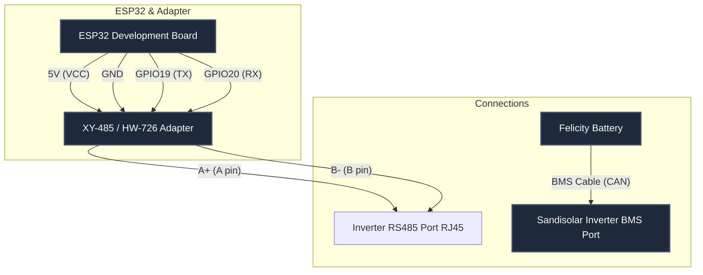

# Implementation Plan - Sandisolar Inverter & Felicity Solar Battery Integration via ESP32

This plan outlines the integration of the Sandisolar 6.5kW hybrid inverter and the Felicity Solar battery with Home Assistant using an ESP32 microcontroller and a TTL-to-RS485 XY-485 / HW-726 automatic flow-control adapter.

---

## Architecture Options

We propose two integration architectures based on your hardware capabilities:

### Option A: Inverter-Centric Topology (Recommended & Safest)
*   **How it works:** The Felicity Solar battery is connected directly to the inverter's **BMS** port (using CAN or RS485). The inverter reads all battery telemetry (SOC, cells, temperature, alarms) and manages safety limits. The ESP32 is connected to the inverter's **Wi-Fi/RS485** monitoring port.
*   **Why choose this:** This is the safest method for Lithium batteries since the inverter adjusts charging current dynamically based on real-time cell voltages.
*   **Hardware needed:** 1x ESP32, 1x XY-485 adapter, custom RJ45 cables.

### Option B: Shared RS-485 Bus Topology (Direct BMS Reading)
*   **How it works:** The ESP32 acts as the sole Master. The Inverter (Slave ID 1) and Felicity Battery BMS (Slave ID 2) are connected in parallel (daisy-chain) to the same XY-485 transceiver.
*   **When to use:** Use this if the inverter and battery BMS cannot talk to each other directly (incompatible protocols), and you need to monitor battery telemetry directly from the BMS.
*   **Limitation:** Both devices must run at the same baud rate (typically 9600 bps). The inverter will run in "Lead-Acid/Voltage" mode, meaning it won't receive charge limits from the battery dynamically.

---

## Hardware Connection Diagram (Option A)



### RJ45 Connection Pinouts:
1.  **Inverter RS485/WiFi Port RJ45 Pinout:**
    *   Typically Pin 1 = RS485-B, Pin 2 = RS485-A (or Pin 7 = A, Pin 8 = B, depending on exact generation - check documentation).
2.  **Felicity Battery BMS Port RJ45 Pinout (to Inverter BMS Port):**
    *   **CAN Pins:** Pin 7 = CAN_H, Pin 8 = CAN_L.
    *   **RS485 Pins:** Pin 5 = RS485-B, Pin 6 = RS485-A.

---

## Proposed Changes

We will maintain the following files in the project root:

### [Component: ESPHome Config]

#### [MODIFY] `sandisolar.yml`
- Define ESP32 board configuration.
- Define UART bus (Baud rate `9600`, 8N1) mapping RX and TX pins (RX=GPIO18, TX=GPIO19).
- Define `modbus` component.
- Define `modbus_controller` with Slave ID `1` (Inverter).
- Import registers configuration from `sandisolar.yml.txt` (or merge them into the final yaml).
- Add support for battery telemetry registers parsed from the inverter's Modbus map:
  - Register `127`: Battery Voltage (multiply `0.1`)
  - Register `128`: Battery SOC (no multiplier)
  - Register `141`: BMS Battery Current (multiply `0.01`, signed)
  - Register `142`: BMS Battery Temperature (multiply `0.1`, signed)
  - Register `143`: BMS Max Charge Current (multiply `0.1`)
  - Register `144`: BMS Max Discharge Current (multiply `0.1`)

---

## User Review Required

> [!IMPORTANT]
> **Automatic Flow Control (XY-485 / HW-726):** Because this adapter handles RX/TX direction hardware-wise using automatic direction control, you **must not** define a `flow_control_pin` or `re_pin` / `de_pin` in the ESPHome YAML. Simply connecting TX, RX, VCC, and GND is sufficient.

> [!WARNING]
> **Ground Loop Safety:** It is highly recommended to power the ESP32 from a separate isolated power supply, or connect the ground of the RS485 bus to protect the ESP32 and the inverter serial port from voltage potentials between the inverter chassis and the power supply.

---

## Open Questions

1.  **Direct BMS compatibility:** Does your Sandisolar inverter currently communicate with the Felicity Solar battery via its BMS cable? (i.e. is the inverter set to "Lithium" and showing battery SOC)? If yes, we will proceed with **Option A** (reading battery data through the inverter).
2.  **RJ45 Pinouts:** Do you have the physical manual for the Sandisolar inverter to confirm the RS485/WiFi port pinout, or should we use the default pin configuration from the community integrations (typically Pin 1/2 or Pin 7/8)?
3.  **ESP32 Pinout:** Which ESP32 pins would you prefer to use for RX and TX? Your current `sandisolar.yml.txt` uses GPIO19 and GPIO20.

---

## Verification Plan

### Manual Verification Steps
1.  Assemble the hardware: connect the ESP32 to the XY-485 board, and the XY-485 board to the inverter's serial port.
2.  Flash the generated YAML configuration to the ESP32 using the ESPHome dashboard or command line:
    ```bash
    esphome run sandisolar.yml
    ```
3.  Monitor the logs in ESPHome dashboard or terminal:
    *   Verify that UART communicates without framing errors.
    *   Verify that Modbus controller receives responses: `ModbusVal...` instead of `Modbus command to 1 address ... failed`.
4.  Verify that sensors appear in Home Assistant showing accurate values (voltage matching the battery display, grid voltage matching the grid, etc.).
