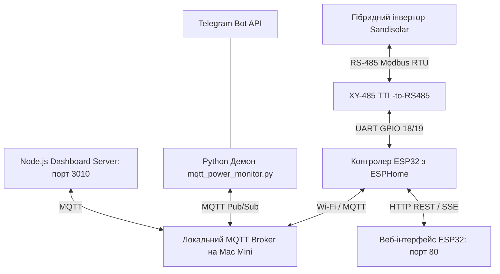

# Опис проєкту: Автоматизація керування гібридним інвертором SandiSolar

Цей документ містить детальний технічний та архітектурний опис системи автономного автоматизованого керування гібридним інвертором **Sandisolar Aohai AO-6KSL-G3** на базі локального MQTT брокера, плати ESP32 та міні-комп'ютера Mac Mini.

Система працює повністю локально, не потребує підключення до хмари, інтернету чи Home Assistant, забезпечуючи максимальну відмовостійкість та автономність.

---

## 1. Архітектура та компоненти системи

Вся система складається з трьох ключових рівнів: апаратного зв'язку, брокера/сервера керування та логічного демона автоматизації.



### 1. Апаратна частина (Контролер ESP32)
* **Чип:** ESP32 DevKitC.
* **Перехідник:** XY-485 (автоматичний контроль напрямку передачі Modbus, без використання RE/DE пінів).
* **Схема підключення:**
  * `5V` (ESP32) ➡️ `VCC` (XY-485)
  * `GND` (ESP32) ➡️ `GND` (XY-485)
  * `GPIO18` (TX) ➡️ `RXD` (XY-485)
  * `GPIO19` (RX) ➡️ `TXD` (XY-485)
  * `A+` / `B-` (XY-485) ➡️ RJ45 порт Modbus інвертора (піни відповідної лінії RS-485).
* **Прошивка:** ESPHome (конфіг `sandisolar.yml`).

### 2. Серверна частина (Node.js & MQTT Broker)
Працює на локальному міні-комп'ютері / сервері:
* **Служба:** `com.antigravity.mqtt` (запускає `server.js`).
* **MQTT Брокер:** Вбудований Aedes (порт `1883`, логін `sandisolar_inv`, пароль `sandisolar_pass`).
* **Веб-сервер:** Дашборд на порту `3010` (відображає сирі логи MQTT та надсилає тестові пакети Modbus).

### 3. Автоматизація та правила (Python Daemon)
* **Служба:** `com.user.mqtt_power_monitor` (запускає `mqtt_power_monitor.py`).
* **Функція:** Зчитує телеметрію з MQTT, обробляє логіку перемикань, відправляє команди інвертору та надсилає сповіщення в Telegram.

---

## 2. Кастомний веб-інтерфейс ESP32 (Web UI)

Плата ESP32 на порту `80` (доступна за локальною IP-адресою) хостить сучасний веб-інтерфейс керування інвертором. Стилі та JS логіка інтегровані безпосередньо в конфіг ESPHome.

* **Стилі (`custom.css`):** Темна скляна тема (Glassmorphism), адаптивна під екрани телефонів та планшетів.
* **Інтерактивна схема енергопотоків:** 
  * Зв'язує 5 блоків: **Сонячні панелі**, **Міська мережа**, **Інвертор**, **Батарея** та **Навантаження будинку**.
  * Лінії зв'язку виконані у вигляді плавних кубічних кривих Безьє.
  * **Потік часток світла (Luminous Gradient Pulse)**: Вздовж ліній безперервно біжать яскраві градієнтні світлові пучки.
  * Кожен потік має свій колір: жовтий (сонце), синій (мережа), зелений (АКБ), фіолетовий (навантаження).
  * **Реверс потоку батареї**: Анімація автоматично змінює свій напрямок: від інвертора до батареї при заряді, та від батареї до інвертора при розряді.
  * При відсутності генерації чи споживання відповідна лінія тьмяніє, а світловий пучок ховається.

---

## 3. Модель поведінки та правила автоматизації

Демон автоматизації опитує MQTT кожні 60 секунд. Для захисту від помилкових перемикань застосовується **дебаунс** (стабілізація стану протягом 2 циклів — 1-2 хвилини).

### 1. Зникнення зовнішньої міської мережі (Outage)
* **Умова:** `Grid Voltage < 100V` (протягом 2 послідовних опитувань).
* **Дія:** Демон надсилає в MQTT топік `command` сигнал `ON` для увімкнення генерації інвертора.
* **Результат:** Інвертор починає живити будинок від акумулятора. Надсилається сповіщення в Telegram.

### 2. Відновлення мережі та вимкнення інвертора
* **Умова:** `Grid Voltage >= 100V` (протягом 2 послідовних опитувань) **ТА** `Battery SOC >= 85%`.
* **Дія:** Демон відправляє команду `OFF` на інвертор.
* **Результат:** Інвертор вимикає власну генерацію і переходить у режим байпасу (живлення будинку від мережі + зарядка АКБ). Надсилається сповіщення в Telegram.
* *Зауваження:* Якщо світло з'явилося, але `SOC < 85%`, інвертор **залишається увімкненим**, щоб підтримувати систему в гаряче резервному стані.

### 3. Примусовий заряд від мережі (Grid Charge)
* **Умова:** Світло є, інвертор вимкнений (`OFF`), але `Battery SOC < 75%`.
* **Дія:** Демон примусово вмикає інвертор (`ON`).
* **Результат:** Інвертор активує заряд акумулятора від міської мережі до досягнення цільового рівня, щоб не тримати батарею розрядженою.

### 4. Режим безпеки (Freeze State)
* **Умова:** Дані телеметрії про напругу мережі (`grid_voltage`) або заряд батареї (`battery_soc`) не оновлювалися в MQTT більше **180 секунд** (3 хвилини).
* **Дія:** Демон входить у стан **Freeze State Active** і блокує виконання будь-яких автоматичних дій.
* **Результат:** Захист від відправки невірних команд при зависанні ESP32 чи відключенні зв'язку. Нормальна робота автоматично відновлюється, як тільки прийдуть свіжі дані.
* *Важливо:* Контроль таймауту вимкнено для перемикача інвертора (`power_switch`), оскільки він надсилає свій статус лише при зміні стану і не має постійного оновлення.

---

## 4. Специфікація системних служб macOS (launchd)

Всі служби можуть бути налаштовані як LaunchAgents у `~/Library/LaunchAgents/`.

| Назва служби (Label) | Файл конфігурації | Опис |
| :--- | :--- | :--- |
| **`com.antigravity.mqtt`** | `com.antigravity.mqtt.plist` | Сервер Node.js (MQTT Брокер Aedes + Дашборд) |
| **`com.user.mqtt_power_monitor`** | `com.user.mqtt_power_monitor.plist` | Python демон контролю інвертора |
| **`com.user.rotate_logs`** | `com.user.rotate_logs.plist` | Служба ротації логів (кожні 12 годин) |

---

## 5. Ротація логів та оптимізація дискового простору

Для уникнення розростання лог-файлів впроваджено автоматичну ротацію:

1. **Для системних логів (stdout/stderr)**:
   * Bash-скрипт `rotate_logs.sh` може запускатися через cron або launchd.
   * Він перевіряє файли: `monitor_stdout.log`, `monitor_stderr.log`, `launchd_stdout.log`, `launchd_stderr.log`.
   * Поріг ротації: **5 MB**. Зберігається до **3 архівних копій** (архіви суфіксуються `.1`, `.2`, `.3`).
2. **Для бізнес-логу подій (`tuya_power_log.json`)**:
   * Обробку вбудовано безпосередньо в код Python-скрипта.
   * Поріг ротації: **2 MB**. Зберігається до **3 копій** через Python `RotatingFileHandler`.

---

## 6. Інструкція для ШІ-агентів (Status / Hermes Agent)

Якщо зовнішній ШІ-агент (наприклад, Hermes) отримує запит про статус системи (чи є світло, який SOC, чи працює інвертор), він має брати інформацію за такою пріоритетністю:

### Пріоритет 1: Зчитування бізнес-логу подій
Найшвидший спосіб дізнатися поточний стан автоматики — прочитати останній рядок файлу подій:
📂 **Шлях:** `./logs/tuya_power_log.json`
Приклад структури JSON:
```json
{"timestamp": "2026-08-20T19:32:42.594720", "event_type": "trigger_inverter_off_skipped", "grid_voltage": 233.1, "status_text": "СВІТЛО Є", "inverter_status": "off", "battery_soc": 96, "action_taken": "skip_already_off"}
```

### Пріоритет 2: Пряме HTTP API плати ESP32
Якщо лог застарів або потрібні абсолютно свіжі апаратні дані, зробити HTTP запит до плати:
* **Напруга мережі:** `GET http://<ESP32_IP>/sensor/grid_voltage`
* **Заряд батареї:** `GET http://<ESP32_IP>/sensor/battery_soc`
* **Стан перемикача:** `GET http://<ESP32_IP>/switch/power_switch`

Детальні інструкції для ШІ-агента задокументовані у файлі `HERMES_INSTRUCTION.md`.
